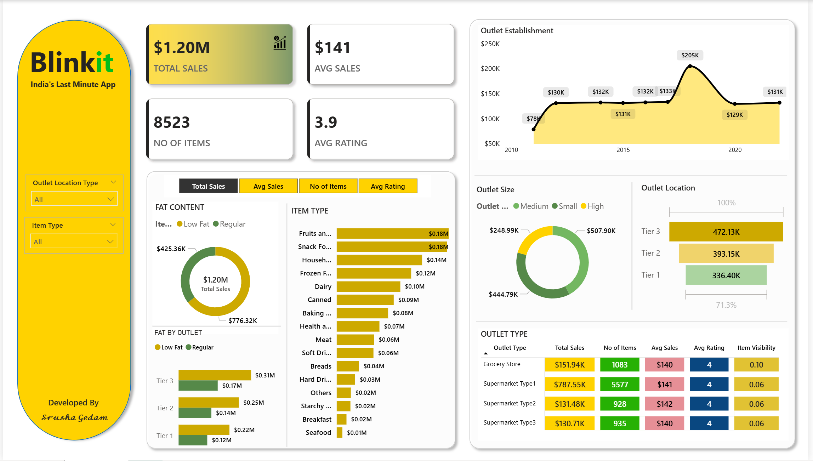

  

# 🛒 Blinkit Sales Dashboard (Power BI)

### 📊 Overview
This project showcases an interactive **Power BI Dashboard** built for **Blinkit (formerly Grofers)** to analyze sales performance, customer trends, and product distribution.  
The dashboard provides real-time insights into business performance, helping stakeholders make data-driven decisions.

---

### 🧩 Key Features
- **Total Sales Analysis:** Track overall sales revenue and growth.
- **Category Performance:** Compare sales across various product categories.
- **Customer Insights:** Identify top customers, order patterns, and repeat buyers.
- **City-wise Analysis:** Visualize performance across multiple locations.
- **Profit & Discount Overview:** Monitor profit margins and applied discounts.
- **Interactive Filters:** Explore data using slicers for category, city, and time period.

---

### 🗂️ Dataset
- **Source:** Blinkit sample sales data (CSV/Excel)
- **Records:** Contains transaction details such as order date, customer ID, product category, city, sales, profit, and discount.

---

### 🧠 Power BI Skills Used
- **Data Modeling:** Relationships between multiple tables.
- **DAX Measures:** For KPIs like Total Sales, Profit %, Average Order Value.
- **Data Cleaning & Transformation:** Using Power Query.
- **Visualization:** Cards, Bar Charts, Donut Charts, Line Charts, Map Visualization.
- **Dashboard Design:** Consistent color palette and layout for clarity.

---

### 🖼️ Dashboard Preview

  

---

### ⚙️ Tools Used
- Microsoft Power BI Desktop  
- Microsoft Excel / CSV (Data Source)  
- DAX (Data Analysis Expressions)

---

### 🚀 How to View
1. Download the `.pbix` file from this repository.  
2. Open it using **Power BI Desktop**.  
3. Explore the dashboard using filters and visuals.

---

### 👩‍💻 Author
**Srusha Gedam**  
💼 *Aspiring Data Analyst / Power BI Developer*  
🔗 [LinkedIn Profile](https://www.linkedin.com/in/srushagedam)

---

### ⭐ Show Your Support
If you found this dashboard interesting, please ⭐ the repository!
